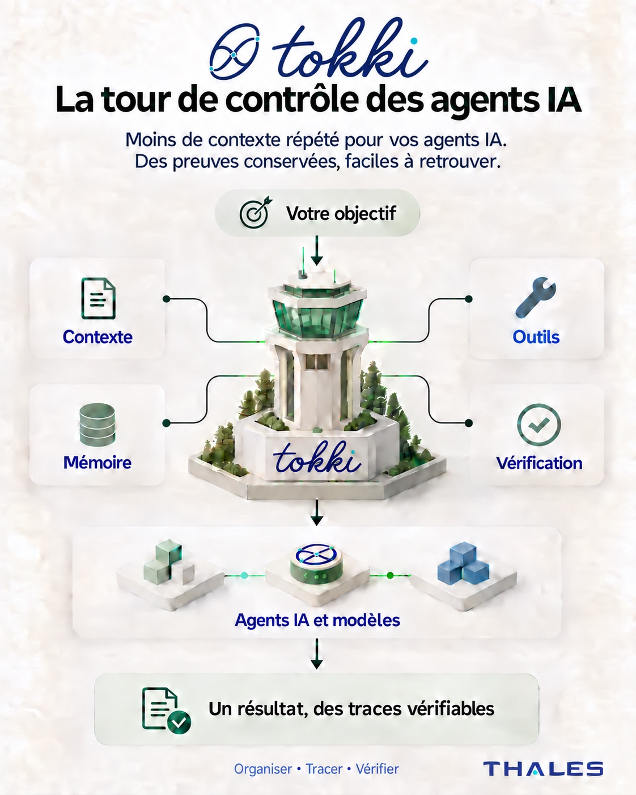
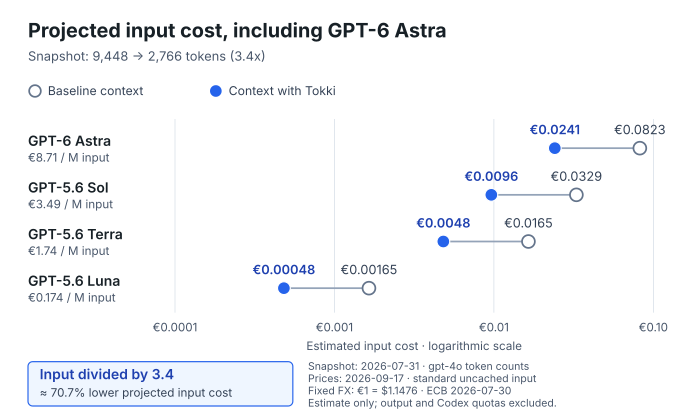

# Tokki

[](LICENSE)
[](RELEASES.md)

Tokki is a proprietary local developer tool with a **pure Rust runtime**,
distributed as compiled wheels.
It is a token killer for local developer sessions: built to cut avoidable local
agent context before it becomes prompt spend, while keeping implementation
details and local payloads private.

This public package and repository contain package information, license
terms, public proof figures, a live demo link, and security-contact guidance.

## Try Tokki × AGILAB on Hugging Face

**[Open the interactive demo →](https://huggingface.co/spaces/jpmorard/tokki)**

Explore five agent-built apps: **MILP Energy Lab**, **Free-threading lab**, an
**INRIA Text Atlas**, **Chronos-2 demand forecasting**, and the original **Iris
decision lab**. Each includes its autonomous build credit, measured build time,
downloadable workflow, and **Build from your own notebook** instructions.

The new [MILP Energy Lab](https://huggingface.co/spaces/jpmorard/tokki?demo=milp)
turns a pinned 2026 PyPSA notebook (CC BY 4.0) into an interactive workbench for
energy planning. Inspect integer schedules, compare saved scenarios, and measure
identical batches on one and multiple AGILAB workers using the free HiGHS solver.
Its recorded autonomous build took **24 minutes** and produced three workflow
stages. Measurements include startup overhead, so parallel runs can be slower.

For the original Iris example, one request turned a pinned
[Géron decision-tree notebook](https://github.com/ageron/handson-ml3/blob/e707c2d659abafb9b1f9fd927907619a128db8d7/06_decision_trees.ipynb)
into a tested app in **4 min 45 sec**. Tokki coordinated the autonomous agent and
verification; AGILAB imported three workflow stages.

The [Text Atlas](https://huggingface.co/spaces/jpmorard/tokki?demo=text) is now rebuilt with local Qwen3.8 27B. Its recorded build took **20.14 minutes**, including independent checks, and preserves the original notebook and 1,250-article corpus. The public cards distinguish the model that generated each app from the algorithms it runs.

In Iris, compare three classifiers, change tree depth, classify a flower, and
rerun the model, notebook, and interface checks in your browser. No account or AI
provider subscription is required to try the public apps.

The Tokki Space presents the working app hosted by the existing public AGILAB
Space. Its public page includes the local notebook setup steps. A standalone
[Gradio version](demo/README.md) is also available for local or CPU hosting.
Fresh autonomous builds run locally through Tokki with your configured AI provider.
Explore the [AGILAB source](https://github.com/ThalesGroup/agilab) or open the
[Hugging Face Space](https://huggingface.co/spaces/jpmorard/tokki).

**Next: [build from your own notebook](https://github.com/ThalesGroup/agilab#build-from-your-own-notebook).**
Use a local notebook or a GitHub notebook pinned to a commit, your own Tokki
installation and provider. The local builder verifies execution and interface
behavior, then imports the AGILAB workflow. Successful builders can voluntarily
report a content-free completion receipt; nothing is uploaded automatically.

Repository validation runs through local maintainer gates. GitHub Actions is
disabled and this repository intentionally contains no active workflow YAML, so
pushes do not create Actions logs, artifacts, or caches.
Implementation source and detailed operational documentation are private.

## Tokki — teaser

**A control tower for AI agents.** Less repeated context, recoverable work
traces, and results you can check.

<p align="center">
  <a href="docs/assets/tokki-teaser-fr.jpg">
    
  </a>
</p>

*Discover Tokki's approach. See [release information](RELEASES.md) for current
availability.*

## Token-cost teaser

**For 1 million baseline input tokens: approximately 0.145 million with Tokki.**
The chart applies the 6.9x reduction measured on 2026-09-17 to this shared
volume, making projected costs easier to compare.

<p align="center">
  <a href="docs/assets/tokki-context-cost-frontier.svg">
    
  </a>
</p>

[Version française](docs/assets/tokki-context-cost-frontier-fr.svg).
Token counts, prices and ECB exchange rate updated on 2026-09-17.
This is a normalized input-cost projection across requests, not a measured
million-token workload. See the [Public Report](#public-report)
and [aggregate measurement receipt](docs/evidence/token-cost-snapshot-2026-09-17.json).

## Public Report

This report contains summary-only public evidence from local metadata.

The benchmark pack was rerun on **2026-09-17**, using Tokki **1.0.63** and exact
`gpt-4o` token counting (grade A). The two available scenarios cover scoped
agent policy and repository context. Their counts are retained in an
[aggregate receipt](docs/evidence/token-cost-snapshot-2026-09-17.json).
Private inputs are not published: this is not a reproducible fixture, and a
later rerun can differ. The workload differs from July, so the ratio change
does not establish a like-for-like product improvement. Projected model costs
are estimates; task success and model quality were not measured.

| Signal | Figure | Public evidence boundary |
|---|---:|---|
| Published session demo (2026-06-05) | 99.0% avoidable context removed | historical local-ledger summary; not rerun in this capture |
| Published session net result (2026-06-05) | 4,233,059 tokens kept local | historical aggregate public proof; not rerun in this capture |
| Dated benchmark snapshot (2026-09-17) | 11,989 baseline -> 1,736 Tokki tokens, 6.9x | exact `gpt-4o` count, 2 available scenarios; aggregate receipt published |
| Scoped agent policy (2026-09-17) | 4,796 baseline -> 352 Tokki tokens, 13.6x | full policy context versus compact policy summary |
| Dirty-worktree context (2026-09-17) | 7,193 baseline -> 1,384 Tokki tokens, 5.2x | repository orientation context versus compact opening brief |
| Supplied failure-log digest (2026-07-31) | 48,752 baseline -> 719 Tokki tokens, 67.8x | historical result; unavailable in the new run and excluded from its totals |
| Cost projection | currency-aware projected avoided | configured price inputs; not billing evidence |
| Privacy guard | 0 strict findings | tracked `HEAD` content only; Git history, forks, caches, and external services are outside this claim |

The [input-cost comparison](docs/assets/tokki-context-cost-frontier.svg)
([French](docs/assets/tokki-context-cost-frontier-fr.svg)) now includes
[GPT-6 Astra](https://developers.openai.com/api/docs/models/gpt-6-astra).
Standard uncached input prices checked on 2026-09-17 are $10.00 for Astra,
$4.00 for [Sol](https://developers.openai.com/api/docs/models/gpt-5.6-sol),
$2.00 for [Terra](https://developers.openai.com/api/docs/models/gpt-5.6-terra),
and $0.20 for [Luna](https://developers.openai.com/api/docs/models/gpt-5.6-luna)
per million tokens. The chart uses the
[ECB exchange rate](https://www.ecb.europa.eu/stats/policy_and_exchange_rates/euro_reference_exchange_rates/html/eurofxref-graph-usd.en.html)
of 1.1481 USD per EUR (2026-09-17). It scales the freshly measured `gpt-4o`
token ratio to 1 million baseline input tokens (approximately 0.145 million
with Tokki), accumulated across requests of at most 272,000 input tokens
each, so standard rates apply. This is a normalized price projection, not a
measured million-token workload, an Astra benchmark or a quality comparison.
Output, caching, tools and Codex subscription quotas are excluded.
A later benchmark rerun can differ.

Prior published readings of 590x on the dirty-worktree row and 80,485 net
tokens on the pack do not reproduce under exact counting on the current
runtime; the figures above supersede them.

This is a public teaser, not an operational manual. Detailed mechanisms,
commands, source paths, raw logs, and private reports stay out of this
repository.

## Tokki and Caveman Code

Caveman Code is the agent choice: a full terminal coding agent whose token
strategy is to keep its own replies terse and enforce tight tool-output budgets.

Tokki is the wrapper choice: a source-private, compiled local layer that keeps
your existing agent commands and reduces avoidable local context before it
becomes prompt spend. Public Tokki evidence remains summary-only: no prompts,
raw logs, file bodies, source paths, or implementation details.

Use Caveman Code when you want the agent itself to be the frugal surface. Use
Tokki when you want a private compiled-wheel layer around the agents you already
use. The two can complement each other: Tokki can install wrappers with
`tokki setup` without making the Tokki source public.

The private CLI also includes `tokki benchmark` for comparing report-path
timings. Public claims, the cost model, and the non-reproducible fixture
boundary are defined in [BENCHMARK.md](BENCHMARK.md).

## Install

Compiled wheel files are distributed privately to authorized users. This public
repo does not host wheel artifacts. After receiving the wheel matching your OS,
install it from a local path, then verify with `tokki --version` and
`tokki doctor --strict`.

### PyPI status

PyPI's current inert name-retention placeholder is `tokki 0.0.1`. It contains
no Tokki runtime and declares `Requires-Python >=99`, so `pip` will not install
it in supported Python environments. It exists solely to retain the Tokki
project name. The current private runtime is `Tokki 1.0.63`; its public
integrity record is
[v1.0.63 release evidence](RELEASES.md). PyPI publishing is retired and is not
the Tokki distribution channel.

After install, the non-destructive first-run check is:

```sh
tokki proof
tokki smoke
tokki privacy explain
```

To install available wrappers and run the same trust/adoption proof in one
flow:

```sh
tokki setup --guided
```

### macOS

Apple Silicon:

```sh
python3 -m pip install --user --upgrade --force-reinstall \
/path/to/tokki-1.0.63-py3-none-macosx_11_0_arm64.whl
export PATH="$(python3 -m site --user-base)/bin:$HOME/.local/bin:$PATH"
tokki --version
```

Optional isolated install with `uv`:

```sh
uv tool install --force \
/path/to/tokki-1.0.63-py3-none-macosx_11_0_arm64.whl
tokki --version
```

Install wrappers after the wheel is installed:

```sh
tokki setup --guided
```

Uninstall:

```sh
python3 -m pip uninstall -y tokki
uv tool uninstall tokki 2>/dev/null || true
```

### Linux

x86_64:

```sh
python3 -m pip install --user --upgrade --force-reinstall \
/path/to/tokki-1.0.63-py3-none-manylinux_2_35_x86_64.whl
export PATH="$HOME/.local/bin:$PATH"
tokki --version
```

Optional isolated install with `pipx`:

```sh
python3 -m pipx install --force \
/path/to/tokki-1.0.63-py3-none-manylinux_2_35_x86_64.whl
tokki --version
```

Install wrappers after the wheel is installed:

```sh
tokki setup --guided
```

Uninstall:

```sh
python3 -m pip uninstall -y tokki
python3 -m pipx uninstall tokki 2>/dev/null || true
```

### Agent Wrappers On POSIX

After install, run `tokki setup` to install wrappers and check the health of the
local wrapper path. For `codex`, the health report also compares the installed
CLI version against the latest published `@openai/codex` version when both can
be parsed as real semver tokens; otherwise the version stays unknown and Tokki
does not claim an upgrade.

Tokki does not silently replace one agent command with another by default.
Cross-agent low-tier handoff, for example launching Codex from a simple Claude
one-shot prompt, is opt-in. The installer can write a small `install.env`
config that sets `TOKKI_MODEL_LOW_AGENT`, `TOKKI_MODEL_ALLOW_CROSS_AGENT_HANDOFF`,
and optionally `TOKKI_MODEL_LOW_HANDOFF_MODEL`; env vars still override that
file. Set the agent to `codex` to route to the latest GPT mini model, `claude`
to stay on Claude with the provider-resolved low-model alias `haiku`, or
`ollama` with an explicit model name. The `haiku` alias is intentionally used
so the installed Claude CLI resolves its supported current Haiku release rather
than Tokki pinning a retired snapshot. Set the agent to `local` with a command
name and optional fixed args to use another local model CLI instead of Ollama.

Tokki also honors `TOKKI_TOKEN_SAVING_MODE=aggressive`,
`TOKKI_TOKEN_SAVING_MODE=ultimate`, or `TOKKI_TOKEN_SAVING_MODE=emergency`.
Weekly-hours quota signals can escalate the mode automatically: `25%` remaining
switches to `aggressive`, `10%` to `ultimate`, and `5%` to `emergency`. The
lower modes reduce the compact-response budget, compact-trigger threshold, and
native output budgets more aggressively than the default mode. When
output overflows, Tokki emits a terse local handle receipt and keeps the full
payload recoverable with `tokki retrieve <handle>`.

### Windows

x86_64 PowerShell:

```powershell
py -m pip install --user --upgrade --force-reinstall `
C:\Path\To\tokki-1.0.63-py3-none-win_amd64.whl
tokki --version
```

Optional isolated install with `pipx`:

```powershell
py -m pip install --user pipx
py -m pipx ensurepath
py -m pipx install --force `
C:\Path\To\tokki-1.0.63-py3-none-win_amd64.whl
tokki --version
```

`ensurepath` affects future shells. If `tokki` is not found in this PowerShell
window, open a new one before running it.

Install wrappers after the wheel is installed:

```powershell
tokki setup --guided
```

Uninstall:

```powershell
py -m pip uninstall -y tokki
pipx uninstall tokki
```

Windows notes:

- The core CLI (`tokki run`, `fix`, `map`, `query`, `model-route`, ...) works
  natively in PowerShell and cmd.
- The installer and `tokki setup` install native `.exe` agent wrappers in the
  same PATH directory as `tokki.exe` when supported agent commands are present.
  Use `-NoWrappers` or `TOKKI_NO_WRAPPERS=1` for a core-CLI-only install. POSIX
  shell shims remain the Unix/WSL path.
- Tokki stores its runtime config under `%APPDATA%\tokki\runtime.json` and
  logs/reports under `%LOCALAPPDATA%\tokki\`. Set `TOKKI_RUNTIME_CONFIG`,
  `TOKKI_LOG_DIR`, or `TOKKI_REPORT_DIR` to override.

## Public Package

Current public package: `tokki 1.0.63`.

`1.0.63` provides private wheelhouse artifacts for:

- macOS arm64: `tokki-1.0.63-py3-none-macosx_11_0_arm64.whl`
- Linux x86_64: `tokki-1.0.63-py3-none-manylinux_2_35_x86_64.whl`
- Windows x86_64: `tokki-1.0.63-py3-none-win_amd64.whl`

The wheel intentionally does not include private implementation source,
repository-local tests, protected Rust source, or private development scripts.

Supported wheel targets are macOS 11+ on Apple Silicon, glibc Linux compatible
with `manylinux_2_35` on x86_64, and 64-bit Windows on x86_64. Python 3.9 or
newer is required. macOS Intel and Linux ARM64 wheels are not currently
distributed. Check [RELEASES.md](RELEASES.md) before installing: an authorized
wheel must match both its published SHA-256 and signed release manifest.

## Support

Use GitHub issues for installation problems and public package metadata issues.
For failure reports, `tokki issue report --dry-run` prepares a bounded,
privacy-filtered **local preview only**. Tokki does not post the preview:
review it and take a separate explicit user action if it is safe to share.
`tokki issue fix` is unsupported in the protected runtime; no GitHub issue is
converted into an executable or automatically applied local bundle. Do not post secrets, prompts, command output,
private repository contents, customer material, absolute paths, or private
branch names in public issues.

For a local trust summary before filing anything public, run
`tokki privacy explain`. It describes what Tokki stores locally, what public
reports omit, and which audit commands to run before sharing artifacts.

See [PRIVACY.md](PRIVACY.md) for the public data boundary,
[SECURITY.md](SECURITY.md) for vulnerability reporting, and
[RELEASES.md](RELEASES.md) to verify an authorized wheel before installation.

For installation or wrapper issues, run `tokki install doctor` first. Use
`tokki path doctor` / `tokki path repair` for PATH drift, `tokki installer-parity`
and `tokki installer-matrix` to compare POSIX, Windows, uv, pipx, and user-site
installer contracts across the private/public surfaces, and `tokki conformance`
for the composed local suite. `tokki release evidence --output tokki-evidence.json`
and `tokki release evidence verify --manifest tokki-evidence.json` write and
verify metadata-only release provenance. `tokki support-bundle --output
tokki-support.json` writes a metadata-only diagnostic bundle for support.
